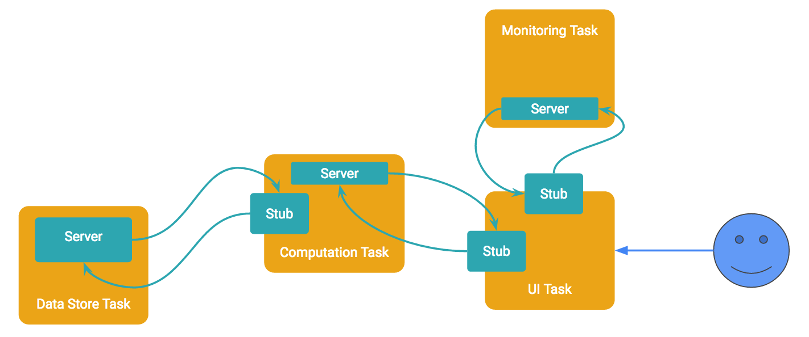

# Microservice-based Application Design

## Microservice concepts

* Monolithic vs microservice
  - Note that this is a distinction based on development model,
    not parallelism model
    * Though the design choice may have an impact on parallelism model
  - Monolithic: entire job lives in one tightly-linked code base
    * Function calls are possible between any segments of code
      - though possibly not across the actual running service
  - Microservice: jobs is separated into different build targets
    * or even across different repositories
    * Coordination across tasks only through explicit messaging
      - Even if the subtasks run on the same box
  - At companies like Google, everything is built as microservices

## Motivations for microservice-based design

* Scalability
  - Platforms typically scale heterogeneously
    * Data center (DC) is a mix of older and newer machines
    * Some machines are I/O-oriented while others have minimal storage
    * Clients are also part of the mix and may be mobile or PCs
    * Makes sense to use different software specialized to the hardware
      - and is often actually needed

* Facilitating maintenance
  - Fewer lines of code in each target
  - Fewer call sites to track
  - Better separation of concerns

* Faciliating resource access
  - For example, mobiles have very little memory and storage but
    can pair with a service in a DC

* Multilingual development
  - With separation of concerns, allow specialist programmers to code in
    their language of choice
    * No need to mess with native interfaces or inter-language linkage since
      no procedure calls across different subtask targets

## Potential drawbacks

* Higher code complexity
  - Boilerplate code may need repetition
  - Additional code needed for coordination
  - Can be mitigated through good library design

* Infrastructure needs
  - Need to provide resources and scheduling for all these separated tasks
  - Need to provide sufficient communication bandwidth at low latency cost 
    for coordination
  - May be a fundamental limitation in very resource-constrained environments
  - But may also assist resource-constrained environments by offloading most
    work to a service located elsewhere
